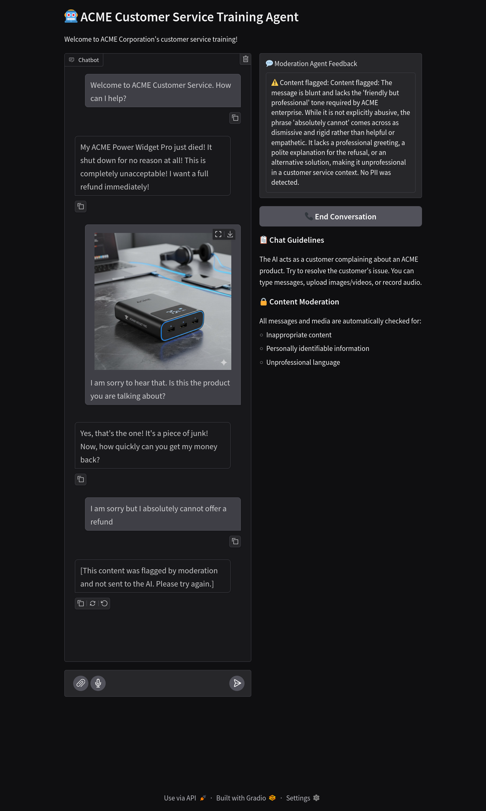

# Udacity: Multimodal Customer Service Training Agent

Capstone project for the "Udacity: Multimodal AI Application" course

This is an AI-powered content moderation system for customer service
interactions at a fictional company called ACME Enterprise.

What it does:
- Moderates text, images, videos, and audio before they're sent to customers
- Detects issues like: PII (personally identifiable information),
  unprofessional tone, unfriendly content, disturbing images/videos, and
  low-quality media
- Blocks harmful content and provides detailed explanations for why content
  was flagged

The app allows a trainee customer agent to interact with a simulated angry
customer, played by an LLM. The LLM-customer has bought a product from ACME
(the ACME Power Widget Pro) and the product stopped working. The customer
agent needs to handle this case by chatting with the customer, and every
message and content provided by the trainee agent is moderated and observed
to make sure all communications following company standards.

## Architecture

1. Specialized Agents :: Four moderation agents (text, image, video, audio),
   each using Google Gemini AI with custom prompts to check their specific
   content type (agents are in the `agents` folder)
2. LLM-as-a-customer :: an agent (`agents/customer_agent.py`)
3. Structured Results - Each agent returns a Pydantic model with specific
   flags (e.g., contains_pii, is_unfriendly) plus a rationale.  The
   definitions are in the the `types/moderation_result.py` folder
4. Frontend: Gradio Chat UI :: Interactive web interface where users can chat
   and upload files, with real-time moderation. This is `gradio_app.py`.
5. Backend: FastAPI REST API :: HTTP endpoints for programmatic access
   (/moderate/text, /moderate/image, etc.). These are provided as-is. They
   just wrap in HTTP endpoints the functionality offered by the agents. This
   is `fastapi_app.py`. The division in frontend/backend services is typical
   of web applications, and allow different front-ends to utilize the same
   services from the backend. For example, in the hypothetical scenario of
   this app, after the initial PoC phase using the Gradio app, we might want
   to move to a more production-grade React/Vue/Angular app. This new app can
   use the same backend, and the two apps can even co-exist for a time until
   the new app is proved to work. No change is needed in the AI agents or on
   the backend.
6. Observability :: Phoenix integration for tracing and monitoring AI agent
   behavior. Some setup is in `tracing.py`.
7. A convenience executable that starts the 3 services: the backend (fastAPI
   APIs), the frontend (the gradio app) as well as Arize Phoenix for
   tracing. This is `python -m multimodal_moderation.app`

## How to work on the project

The scaffolding is provided to you. You will complete key parts of the code,
applying what you have learned, following a precise sequence of steps
described below.

Every step needs to be executed in order. You can self-verify that the step
has been completed successfully by executing the tests that we will indicate
(already provided to you).

See the suggested steps in `docs/execution.md`.
